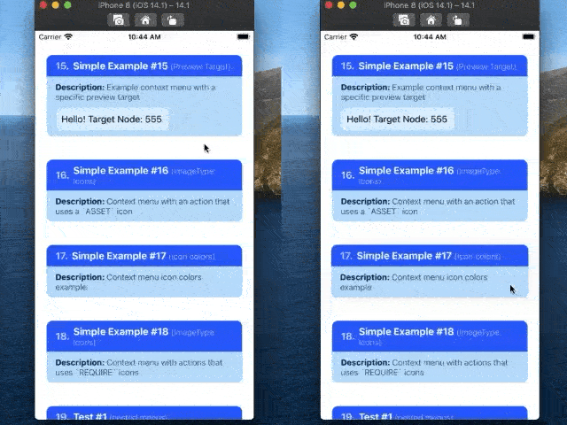
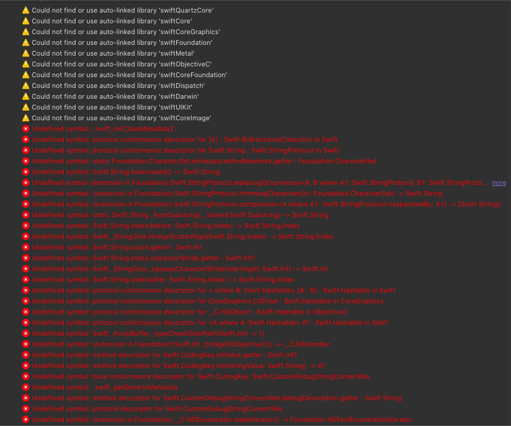
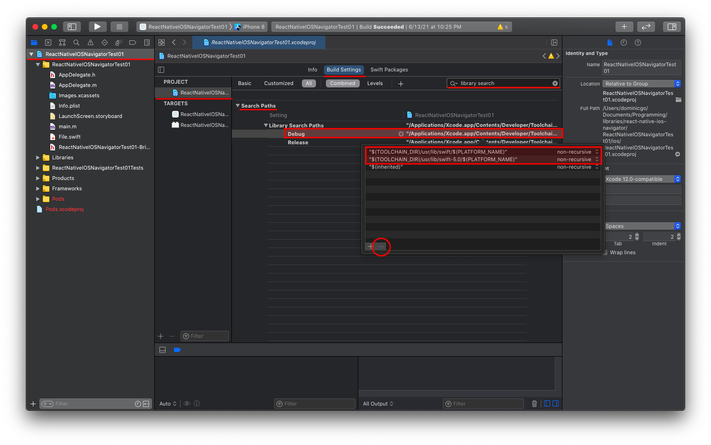

# react-native-ios-context-menu

A small component for using context menu's on iOS.


<br><br>

## 🚧⚠️ Documentation WIP ⚠️🚧

📝 Note: See [`TODO.md`](docs/TODO.md) for progress.

- The documentation is incomplete (some parts/sections are marked as **TBA** i.e. "to be added"). 
- Some of the links in the documentation are broken (i.e. the URL points to `PLACE_HOLDER_LINK`).
- Some of the gifs/images are old, or broken.
- For now, please see the [Usage And Examples](#e-usage-and-examples) section, and [Showcase, Tests and Demos](#F-Showcase-Tests-and-Demos) section for information on how to use this library.

<br><br>

| Notice                                                       |
| ------------------------------------------------------------ |
| 📝 **Note** #1: Version `3.x` is a rewrite of this library to support both fabric (the new architecture), and  offer backwards compatibility to paper (the old architecture).<br><br> Support for the new architecture (fabric), and backwards compatibility for the old architecture (paper) is handled via a peer via a peer dependency to [`react-native-ios-utilites@v5`](https://github.com/dominicstop/react-native-ios-utilities). |
| 📝 **Note** #2: The documentation + examples are currently being rewritten.<br><br>❤️ [`README-old-v1.md`](./README-old-v1.md) — Documentation for `v1.x`<br>🧡 [`README-old-v2.md`](./README-old-v2.md) — Documentation for `v2.x`<br>💛 [`example/src/examples`](./example/src/examples) — The typescript rewrite of the examples (WIP). |

 <br>

### Versions

| Library Version | Compatibility                                                |
| :-------------- | ------------------------------------------------------------ |
| `3.x`+          | Depends on `react-native-ios-utilities@5.x`<br/>Depends on `ContextMenuAuxiliaryPreview`<br/>iOS 13+<br/>Xcode 15+ |
| `2.1`           | Uses `Expo-Modules`<br/>Depends on `react-native-ios-utilities@4.x`<br/>Depends on `ContextMenuAuxiliaryPreview`<br>iOS 13+<br/>Xcode 15+ |
| `2.0.x`         | Uses `Expo-Modules`<br>Depends on `react-native-ios-utilities@4.x`<br>iOS 13+<br>Xcode 15+ |
| `1.6.2`         | iOS 10 to iOS 15<br>Xcode 12+                                |
| `1.4`           | iOS 10 to iOS 15<br>Xcode 13+                                |
| `1.3` and Below | iOS 10 to 14<br>Xcode 12+                                    |

<br><br>

## Table of Contents

| Sections and Links                                           |
| ------------------------------------------------------------ |
| [A. **Introduction**](#a-introduction)<br/><br/>• [Gifs and Demos](#gifs-and-demos)<br/>• [Features](#features) |
| [B. **Installation**](#b-installation)<br><br>• [Expo](#expo)<br/>• [Troubleshooting](#troubleshooting)<br>--• [Xcode Build Error (Swift)](#troubleshooting-xcode-build-error-(swift))<br>--• [Xcode Build Error (Undefined symbol)](#troubleshooting-xcode-build-error-(undefined-symbol)) |
| [C. **Basic Usage**](#c-basic-usage)                         |
| [D. **Documentation**](#d-documentation)<br/><br/>• [D.1. Components](#d1-components)<br/>--• [`ContextMenuView` Component](#contextmenuview-component)<br/>----• [Props](#contextmenuview-component-props)<br/>----• [Event Props](#contextmenuview-component-event-props)<br>----• [Properties/Methods](#contextmenuview-component-properties/methods)<br>----• [Experimental - Aux. Preview](#contextmenuview-component-experimental---auxiliary-preview)<br><br>--• [`ContextMenuButton` Component](#contextmenubutton-component)<br/>----• [Props](#contextmenubutton-component-props)<br/>----• [Event Props](#contextmenubutton-component-event-props)<br/>----• [Properties/Methods](#contextmenubutton-component-properties/methods)<br/><br/>• [D.2. Context](#d2-context)<br/>--• [`ContextMenuButtonContext`](#ContextMenuButtonContext-context)<br/>--• [`ContextMenuButtonContext`](#ContextMenuButtonContext-context)<br><br/>• [D.3. Hooks](#d3-hooks)<br/>--• [`useMenuContext`](#useMenuContext-hook)<br/>--• [`useMenuButtonContext`](#useMenuButtonContext-hook)<br><br>• [D.4. Objects and Types](#d4-objects-and-types)<br/>--• [`MenuConfig.ts`](#MenuConfigts)<br/>----• [Object Type: `MenuConfig`](#Object-Type-MenuConfig)<br/>----• [Object Type: `MenuActionConfig`](#Object-Type-MenuActionConfig)<br/>----• [Object Type: `DeferredMenuElementConfig`](#Object-Type-DeferredMenuElementConfig)<br/>----• [String Union: `MenuAttributes`](#String-Union-MenuAttributes)<br/>----• [String Union: `MenuState`](#String-Union-MenuState)<br/>----• [String Union: `UIMenuOptions`](#String-Union-UIMenuOptions)<br/><br>--• [`MenuPreviewConfig.ts`](#MenuPreviewConfigts)<br/>----• [Object Type: `MenuPreviewConfig`](#Object-Type-MenuPreviewConfig)<br/>----• [String Union: `ContextMenuInteractionCommitStyle`](#String-Union-ContextMenuInteractionCommitStyle)<br/>----• [String Union: `MenuPreviewSize`](#String-Union-MenuPreviewSize)<br/>----• [String Union: `MenuPreviewType`](#String-Union-MenuPreviewType)<br/><br>--• [`MenuAuxiliaryPreviewConfig.ts`](#MenuAuxiliaryPreviewConfigts)<br/>----• [Object Type: `MenuAuxiliaryPreviewConfig`](#Object-Type-MenuAuxiliaryPreviewConfig)<br/>----• [String Union Type: `MenuAuxiliaryPreviewAnchorPosition`](#String-Union-Type-MenuAuxiliaryPreviewAnchorPosition)<br/>----• [String Union Type: `MenuAuxiliaryPreviewHorizontalAlignment`](#String-Union-Type-MenuAuxiliaryPreviewHorizontalAlignment)<br/>----• [String Union Type: `UIViewAnimateOptions`](#String-Union-Type-UIViewAnimateOptions)<br/>----• [Object Type: `UIViewAnimateConfig`](#Object-Type-UIViewAnimateConfig)<br/>----• [Object Type: `MenuAuxiliaryPreviewBaseTransitionConfig`](#Object-Type-MenuAuxiliaryPreviewBaseTransitionConfig)<br/>----• [Object Union Type: `MenuAuxiliaryPreviewTransitionConfig`](#Object-Union-Type-`MenuAuxiliaryPreviewTransitionConfig`)<br/>----• [Mixed Union Type: `MenuAuxiliaryPreviewTransitionEntranceDelay`](#Mixed-Union-Type-MenuAuxiliaryPreviewTransitionEntranceDelay)<br/><br>--• [`MenuIconConfig.ts`](#MenuIconConfigts)<br/>--• [`ImageItemConfig.ts`](#ImageItemConfigts)<br/>----• [Object Type: `ImageItemConfig`](#Object-Type-ImageItemConfig)<br/>----• [Object Type: `ImageResolvedAssetSource`](#Object-Type-ImageResolvedAssetSource)<br/>----• [Object Type: `ImageRectConfig`](#Object-Type-ImageRectConfig)<br/>----• [Object Type: `ImageGradientConfig`](#Object-Type-ImageGradientConfig)<br/>----• [Object Type: `ImageSystemConfig`](#Object-Type-ImageSystemConfig)<br/><br>--• [Undocumented Types](#Undocumented-Types)<br><br>• [D.5. Constants](#d5-constants) |
| [E. **Usage And Examples**](#E-Usage-And-Examples)<br/>📝 **Note**: See [Example Index](#toc-examples-index) section for a complete list of examples + their descriptions. |
| [F. **Showcase, Tests and Demos**](#F-Showcase-Tests-and-Demos) |
| [G. **Meta**](#G-Meta)                                       |
| [H. **Licence**](#H-Licence)                                 |

<br>

### TOC: Examples Index

| Examples                                                     |
| ------------------------------------------------------------ |
| 📌 **[`ContextMenuView` Example 01](#ContextMenuView-Example-01)**<br/>💭 **Summary**:  A basic context menu that has 3 menu action items. |
| 📌 **[`ContextMenuView` Example 02](#ContextMenuView-Example-02)**<br/>💭 **Summary**: Icon Example — A basic context menu that has 3 menu action items, each with a different "SF Symbols" icon. This examples shows how to add a system icon in the context menu action. |
| 📌 **[`ContextMenuView` Example 03](#ContextMenuView-Example-03)**<br/>💭 **Summary**: Nested Menu — This example shows a context menu that has a submenu item inside its list of menu actions. |
| 📌 **[`ContextMenuView` Example 04](#ContextMenuView-Example-04)**<br/>💭 **Summary**: Menu Attributes — This example context menu showcases the `MenuActionConfig.menuAttributes` property. |
| 📌 **[`ContextMenuView` Example 05](#ContextMenuView-Example-05)**<br/>💭 **Summary**: Nested Menu + Menu Attributes — A context menu that has a in-line submenu. |
| 📌 **[`ContextMenuView` Example 06](#ContextMenuView-Example-06)**<br/>💭 **Summary**: Menu Options — A context menu that has a destructive submenu. |
| 📌 **[`ContextMenuView` Example 07](#ContextMenuView-Example-07)**<br/>💭 **Summary**: Menu Options — A context menu that set to be both "destructive" and "display in-line". |
| 📌 **[`ContextMenuView` Example 08](#ContextMenuView-Example-08)**<br/>💭 **Summary**: Menu State — A context menu with 3 actions that has `'on'`, `'off'`, and `'mixed'` `menuState`. |
| 📌 **[`ContextMenuView` Example 09](#ContextMenuView-Example-09)**<br/>💭 **Summary**: Events — An example for the `onPressMenuItem` event prop. |
| 📌 **[`ContextMenuView` Example 10](#ContextMenuView-Example-10)**<br/>💭 **Summary**: Dynamic Menu — An example showing how to dynamically update the context menu while it's visible. In this example, the menu action changes every time the counter increments every second. |
| 📌 **[`ContextMenuView` Example 11](#ContextMenuView-Example-11)**<br/>💭 **Summary**: Context Menu Previews — An example showing how to use a custom preview for the context menu. |
| 📌 **[`ContextMenuView` Example 12](#ContextMenuView-Example-12)**<br/>💭 **Summary**: Context Menu Previews — An example showing a custom context menu preview that dynamically changes its size due to its contents updating every second. |
| 📌 **[`ContextMenuView` Example 13](#ContextMenuView-Example-13)**<br/>💭 **Summary**: Menu Action — An example showing how to add a subtitle to menu action. |
| 📌 **[`ContextMenuView` Example 14](#ContextMenuView-Example-14)**<br/>💭 **Summary**: Context Menu Previews — An example that changes the exit transition of the context menu preview when its tapped using the `preferredCommitStyle ` config. |
| 📌 **[`ContextMenuView` Example 15](#ContextMenuView-Example-15)**<br/>💭 **Summary**: Context Menu Previews — An example showing how to configure a context menu that uses targeted previews. |
| 📌 **[`ContextMenuView` Example 15-02](#ContextMenuView-Example-15-02)**<br/>💭 **Summary**: Context Menu Previews (Cont). — An example showing how to configure a context menu that uses targeted previews + `WrapperView`. |
| 📌 **[`ContextMenuView` Example 16](#ContextMenuView-Example-16)**<br/>💭 **Summary**: Icon Example — An example showing a context menu with an action that uses a `'IMAGE_ASSET'` image for its icon. |
| 📌 **[`ContextMenuView` Example 17](#ContextMenuView-Example-17)**<br/>💭 **Summary**: Icon Example — An example showing a context menu with action items that have different colored icons. |
| 📌 **[`ContextMenuView` Example 18](#ContextMenuView-Example-18)**<br/>💭 **Summary**: Icon Example — An example showing a context menu with action items that has icons that uses local image assets imported via `require(...)`. |
| 📌 **[`ContextMenuView` Example 19](#ContextMenuView-Example-19)**<br/>💭 **Summary**: Dynamic Menu — An example showing a context menu that has a loading indicator using deferred menu elements. |
| 📌 **[`ContextMenuView` Example 20](#ContextMenuView-Example-20)**<br/>💭 **Summary**: Dynamic Menu — An example showing a state-controlled context menu that shows a loading indicator using deferred menu elements. |
| 📌 **[`ContextMenuView` Example 21](#ContextMenuView-Example-21)**<br/>💭 **Summary**: Menu Element Size — TBA |
| 📌 **[`ContextMenuView` Example 22](#ContextMenuView-Example-22)**<br/>💭 **Summary**: Menu Element Size — TBA |
| 📌 **[`ContextMenuView` Example 23](#ContextMenuView-Example-23)**<br/>💭 **Summary**: Menu Element Size — TBA |
| 📌 **[`ContextMenuView` Example 24](#ContextMenuView-Example-24)**<br/>💭 **Summary**: Menu Attributes — `keepsMenuPresented` |
| 📌 **[`ContextMenuView` Example 25](#ContextMenuView-Example-25)**<br/>💭 **Summary**: Icon Example — Advanced customization (E.g. `scale`, `weight`, `paletteColors`, `hierarchicalColor`). |
| 📌 **[`ContextMenuView` Example 26](#ContextMenuView-Example-26)**<br/>💭 **Summary**: Icon Example — Network/Remote images as icons. |
| 📌 **[`ContextMenuView` Example 27](#ContextMenuView-Example-27)**<br/>💭 **Summary**: Icon Example — Network/Remote images as icons + fallback image. |
| 📌 **[`ContextMenuView` Example 28](#ContextMenuView-Example-28)**<br/>💭 **Summary**: Programmatically shows the context menu. |
| 📌 **[`ContextMenuView` Auxiliary Preview - Example 01](#ContextMenuView-Auxiliary-Preview---Example-01)**<br/>💭 **Summary**: TBA |
| 📌 **[`ContextMenuView` Auxiliary Preview - Example 02](#ContextMenuView-Auxiliary-Preview---Example-02)**<br/>💭 **Summary**: TBA |
| 📌 **[`ContextMenuView` Auxiliary Preview - Example 03](#ContextMenuView-Auxiliary-Preview---Example-03)**<br/>💭 **Summary**: TBA |
| 📌 **[`ContextMenuView` Auxiliary Preview - Example 04](#ContextMenuView-Auxiliary-Preview---Example-04)**<br/>💭 **Summary**: TBA |
| 📌 **[`ContextMenuView` Auxiliary Preview - Example 05](#ContextMenuView-Auxiliary-Preview---Example-05)**<br/>💭 **Summary**: TBA |
| 📌 **[`ContextMenuView` Auxiliary Preview - Example 06](#ContextMenuView-Auxiliary-Preview---Example-06)**<br/>💭 **Summary**: TBA |
| 📌 **[`ContextMenuView` Auxiliary Preview - Example 07](#ContextMenuView-Auxiliary-Preview---Example-07)**<br/>💭 **Summary**: TBA |
| 📌 **[`ContextMenuView` Auxiliary Preview - Example 08](#ContextMenuView-Auxiliary-Preview---Example-08)**<br/>💭 **Summary**: TBA |
| 📌 **[`ContextMenuView` Auxiliary Preview - Example 09](#ContextMenuView-Auxiliary-Preview---Example-09)**<br/>💭 **Summary**: TBA |
| 📌 **[`ContextMenuView` Auxiliary Preview - Example 10](#ContextMenuView-Auxiliary-Preview---Example-10)**<br/>💭 **Summary**: TBA |
| 📌 **[`ContextMenuView` Auxiliary Preview - Example 11](#ContextMenuView-Auxiliary-Preview---Example-11)**<br/>💭 **Summary**: TBA |
| 📌 **[`ContextMenuView` Auxiliary Preview - Example 12](#ContextMenuView-Auxiliary-Preview---Example-12)**<br/>💭 **Summary**: TBA |
| 📌 **[`ContextMenuView` Auxiliary Preview - Example 13](#ContextMenuView-Auxiliary-Preview---Example-13)**<br/>💭 **Summary**: TBA |
| 📌 **[`ContextMenuView` Auxiliary Preview - Example 14](#ContextMenuView-Auxiliary-Preview---Example-14)**<br/>💭 **Summary**: TBA |
| 📌 **[`ContextMenuView` Auxiliary Preview - Example 15](#ContextMenuView-Auxiliary-Preview---Example-15)**<br/>💭 **Summary**: TBA |
| 📌 **[`ContextMenuView` Auxiliary Preview - Example 16](#ContextMenuView-Auxiliary-Preview---Example-16)**<br/>💭 **Summary**: Programmatically shows the auxiliary preview as a popover (w/o showing the context menu). |
| 📌 **[`ContextMenuButton` Example 01](#ContextMenuButton-Example-01)**<br/>💭 **Summary**: TBA |
| 📌 **[`ContextMenuButton` Example 02](#ContextMenuButton-Example-02)**<br/>💭 **Summary**: TBA |

<br><br>

### Acknowledgements

Development and maintenance of this library was generously sponsored by [beatgig](https://beatgig.com/) from `11/15/2023` to ` 04/30/2024` at `$1,535`/month (totaling ≈ `$9,100` over the course of 6 months) 🥁🎸

<br>

The initial fabric rewrite (i.e. version `3.x`) was made possible through a generous `$3,750` sponsorship by [natew](https://github.com/natew) + [tamagui](https://github.com/tamagui/tamagui) over the course of 4 months (from: `05/27/24` to `09/30/24`) 🐦✨

<br>

very special thanks to: [junzhengca](https://github.com/junzhengca), [brentvatne](https://github.com/brentvatne), [expo](https://github.com/expo), [EvanBacon](https://github.com/EvanBacon), [corasan](https://github.com/corasan), [lauridskern](https://github.com/lauridskern), and [ronintechnologies](https://github.com/ronintechnologies) for becoming a monthly sponsor and [fobos531](https://github.com/fobos531) for being a one time sponsor 🥺 (if you have the means to do so, please considering sponsoring [here](https://github.com/sponsors/dominicstop))

<br><br>

## A. Introduction

A react native component to use [`UIMenu`](https://developer.apple.com/documentation/uikit/uimenu) on iOS 13 and later.

<br>

### Gifs and Demos

📝 **Note**: These gifs are from an older version of the library running on iOS 13 (see [Usage And Examples](#e-usage-and-examples) section for updated example gifs).<br>

`ContextMenuView` Examples, **Left**: [Example 1](#ContextMenuView-Example-01), [Example 2](#ContextMenuView-Example-02), and **Right**: [Example 3](#ContextMenuView-Example-03), [Example 4](#ContextMenuView-Example-04)


`ContextMenuView` examples, **Left**: [Example 5](#ContextMenuView-Example-05), [Example 6](#ContextMenuView-Example-06), and **Right**: [Example 7](#ContextMenuView-Example-07), [Example 8](#ContextMenuView-Example-08)


`ContextMenuView` example, **Left**: [Example 9](#ContextMenuView-Example-09), and **Right**: [Example 10](#ContextMenuView-Example-10)


`ContextMenuView` examples, **Left**: [Example 11](#ContextMenuView-Example-11), [Example 12](#ContextMenuView-Example-12), and **Right**: [Example 13](#ContextMenuView-Example-13), [	Example 14](#ContextMenuView-Example-14)


`ContextMenuView` examples, **Left**: [Example 15](#ContextMenuView-Example-15), [Example 16](#ContextMenuView-Example-16), and **Right**: [Example 17](#ContextMenuView-Example-17), [Example 18](#ContextMenuView-Example-18)


`ContextMenuView` tests, **Left**: [Test 1](PLACE_HOLDER_LINK), and **Right**: [Test 2](PLACE_HOLDER_LINK)


`ContextMenuView` tests, **Left**: [Test 3](PLACE_HOLDER_LINK), and **Right**: [Test 4](PLACE_HOLDER_LINK)


`ContextMenuView` tests, **Left**: [Test 5](PLACE_HOLDER_LINK), and **Right**: [Test 6](PLACE_HOLDER_LINK)


`ContextMenuView` tests, **Left/Right:** [Test 7](PLACE_HOLDER_LINK)


`ContextMenuView` `ActionSheetIOS` fallback for simple example 1 to 9


`ContextMenuView` `ActionSheetIOS` fallback for context menu view test 1 to 6 (removed in `v3.x`+).


`ContextMenuButton` examples, **Left**: [Example 1](#ContextMenuButton-Example-01), and **Right**: [Example 2](#ContextMenuButton-Example-02)


<br>

### Features

* Support for creating menu actions and submenus (i.e. nested and in-line menus).
* Support for customizing the menu icons (i.e. support for SF Symbols, `require(image)`, and `xcasset` icons, icon tint, etc).
* Extensive support for SF Symbols configuration (e.g. `pointSize`, `weight`, `scale`, `hierarchicalColor`, `paletteColors`).
* Support for iOS 14 functionality (like the `UIButton` context menu, dynamically updating the menu while it's visible, etc).
* Support for setting (almost) all of the native [`UIMenu`](https://developer.apple.com/documentation/uikit/uimenu) and [`UIAction`](https://developer.apple.com/documentation/uikit/uiaction) properties (e.g. `UIMenuElementState`,  `MenuElementAtrributes`, `discoverabilityTitle`, etc.)
* Basic `ActionSheetIOS` menu fallback for iOS 12 and below (removed in `v3.x`+).
* Support for creating custom context menu previews (with support for dynamic or fixed preview sizes, setting the [`UIPreviewParameters`](https://developer.apple.com/documentation/uikit/uipreviewparameters), specifying a [`UITargetedPreview`](https://developer.apple.com/documentation/uikit/uitargetedpreview), etc).
* Support for custom auxiliary previews (experimental).
* Support for deferred context menu items.

<br><br>

## B. Installation

```sh
# 1. install library + dependencies
npm install react-native-ios-utilities@next
npm install react-native-ios-context-menu@next

# 2. then run pod install (uses auto-linking)
cd ios && pod install
```

<br>

📝 **Note A**: You might encounter some build errors since this library is written in swift, so there's some extra step involved to use this library (see table below for reference).

<br>📝 **Note B**: If you want to use an older or different version of this library, please refer to [versions section](#versions)'s compatibility table.

| Additional Steps                                             |
| :----------------------------------------------------------- |
| 1️⃣ [Add an empty swift file to your project](#troubleshooting-xcode-build-error-swift) |
| 2️⃣ [Update the project's "Library Search Paths" build settings](#troubleshooting-xcode-build-error-undefined-symbol) |

<br>

### Installation (Experimental Version)

```sh
# 1. install library + dependencies
npm install react-native-ios-utilities@next
npm install react-native-ios-context-menu@next


# 2. then run pod install (uses auto-linking)
cd ios && pod install
```

<br>

### Updating

This library has cocoapods dependency to [`ContextMenuAuxiliaryPreview`](https://github.com/dominicstop/ContextMenuAuxiliaryPreview) and [`DGSwiftUtilities`](https://github.com/dominicstop/DGSwiftUtilities), so you may need to update them separately (as needed).

```sh
# A. Either update this specific pod...
pod update ContextMenuAuxiliaryPreview DGSwiftUtilities
pod install --repo-update

# B. Or update all the pods
pod update
```

<br>

### Expo

- ✅ You can use this library with [Development Builds](https://docs.expo.dev/development/introduction/). No config plugin is required.
- ❌ This library can't be used in the "Expo Go" app because it [requires custom native code](https://docs.expo.dev/workflow/customizing/).

<br>

###  Versions and Dependencies

| Library Version | Dependencies + Versions                                      |
| --------------- | ------------------------------------------------------------ |
| `2.0.x`         | `react-native-ios-utilities` - `4.x`                         |
| `2.1.x`         | `react-native-ios-utilities` - `4.x`<br>`ContextMenuAuxiliaryPreview` - `0.1.x` |
| `2.2.x`         | `react-native-ios-utilities` - `4.x`<br/>`ContextMenuAuxiliaryPreview` - `0.2.x` |

<br>

### Troubleshooting

If you encounter any errors/bugs while using this library, or want a particular feature implemented, please create an issue (my inbox is a mess, please feel free to tag me). ✨

<br>

#### Troubleshooting: Xcode Build Error (Swift)

📝 **Note**: This library is written in swift. If you are having trouble building your app after installing this library, try adding an empty swift file to your project:

1. Open up your `ios/project.xcworkspace` project
2. On the project navigator panel (located on the right side of Xcode), right click on your project group (or another folder/group i.e the blue or yellow icons) and select the "*New File...*" option
3. In the popup sheet, select "Swift" as the template and then click the "*Next*" button
4. A "*Save As*" popup sheet should appear and then click "*Create*" (you can rename the file first if you want to)
5. If Xcode asks you to create a "*Objective-C Bridging Header*" choose *"Create Objective-C Bridging Header"*

<br>

#### Troubleshooting: Xcode Build Error (Undefined symbol)

When installing this library on Xcode 12+, you'll get the following error in Xcode:



```
Undefined symbol: (extension in UIKit):
__C.UIMenu.init(title: Swift.String, image: __C.UIImage?, identifier: __C.UIMenuIdentifier?, options: __C.UIMenuOptions, children: [__C.UIMenuElement]) -> __C.UIMenu

Undefined symbol: (extension in UIKit):
__C.UIAction.init(title: Swift.String, image: __C.UIImage?, identifier: __C.UIActionIdentifier?, discoverabilityTitle: Swift.String?, attributes: __C.UIMenuElementAttributes, state: __C.UIMenuElementState, handler: (__C.UIAction) -> ()) -> __C.UIAction
```

<br>

To fix this, see screenshot + follow the steps below:


<br>

1. Open your `ios/project.xcworkspace` project.
2. In the project navigator panel (located on the right side of Xcode), select your project group (i.e. the item with the blueprint icon).
3. The Xcode project editor should appear. In the left panel, under the "Project" section, select your project (if it isn't already selected).
4. In the project section's top tab bar, select the "Build Settings" tab (also make sure the "All" and "Combined" tabs are selected).
5. In the project navigator list, under the "Search Path" section, there should be a "Library Search Paths" setting (alternatively, you can search for "Library Search Paths" in the search bar).
6.  According to this [issue comment](https://github.com/facebook/react-native/issues/29246#issuecomment-667518920), you can clear all the items listed in the "Library Search Paths" setting by selecting the items in the list, and pressing the "-" button in the popover. 
	* **TLDR**: Xcode automatically manages this setting, and the RN template hardcodes it to use Swift 5.0.
	* Alternatively, you can change the entry `"$(TOOLCHAIN_DIR)/usr/lib/swift-5.0/$(PLATFORM_NAME)"` to `"$(TOOLCHAIN_DIR)/usr/lib/swift-5.3/$(PLATFORM_NAME)"` i.e. change `swift-5.0` to `swift-5.3`, or whatever the newest version of swift that comes with your Xcode installation (to show the popup dialog, double click the value/item).
7. If you haven't already, make sure to create an empty swift file. Then clean the build folder (the option is in the menu bar under: "Product" -> "Clean Build Folder") and try building your project again.
8. If you are still having problems building the app, try the following and build your project again:
  * Try clearing out Xcode's `derivedData` directory: `rm -rf ~/Library/Developer/Xcode/DerivedData/*` (check out this [gist](https://gist.github.com/maciekish/66b6deaa7bc979d0a16c50784e16d697) for instructions on how to clean up Xcode)
  * Try clearing out the `Cocoapods` cache: `rm -rf "${HOME}/Library/Caches/CocoaPods"` (and then try running `pod install` again).

<br>



<br>

**Explanation**: Some versions of the react-native template hard codes the swift library search paths to use swift `5.0` (which causes the linker to mismatch the swift system libraries bundled with your Xcode + iOS/Simulator installation).

Here are some related issues in the RN repo: [Issue 30202](https://github.com/facebook/react-native/pull/30202) and [Issue 29178](https://github.com/facebook/react-native/pull/29178). 

<br><br>

## C. Basic Usage

For more examples, check out the [Usage And Examples](#e-usage-and-examples) section.

<br>

[🔗 Full Example](example/src/examples/BasicUsageExample01.tsx)

```jsx
import * as React from 'react';
import { StyleSheet, Text } from 'react-native';

import { ContextMenuView } from 'react-native-ios-context-menu';

export function BasicUsageExample01() {
  return (
    <ContextMenuView
      style={styles.container}
      menuConfig={{
        menuTitle: 'BasicUsageExample01',
        menuItems: [{
          actionKey  : 'key-01',
          actionTitle: 'Action #1',
        }, {
          actionKey  : 'key-02'   ,
          actionTitle: 'Action #2',
        }, {
          actionKey  : 'key-03'   ,
          actionTitle: 'Action #3',
        }],
      }}
    >
      <Text style={styles.text}>
        Press And Hold To Show Context Menu
      </Text>
    </ContextMenuView>
  );
};

const styles = StyleSheet.create({
  container: {
    margin: 10,
    padding: 10,
  },
  text: {
    fontSize: 16,
  },
});
```

<br><br>

